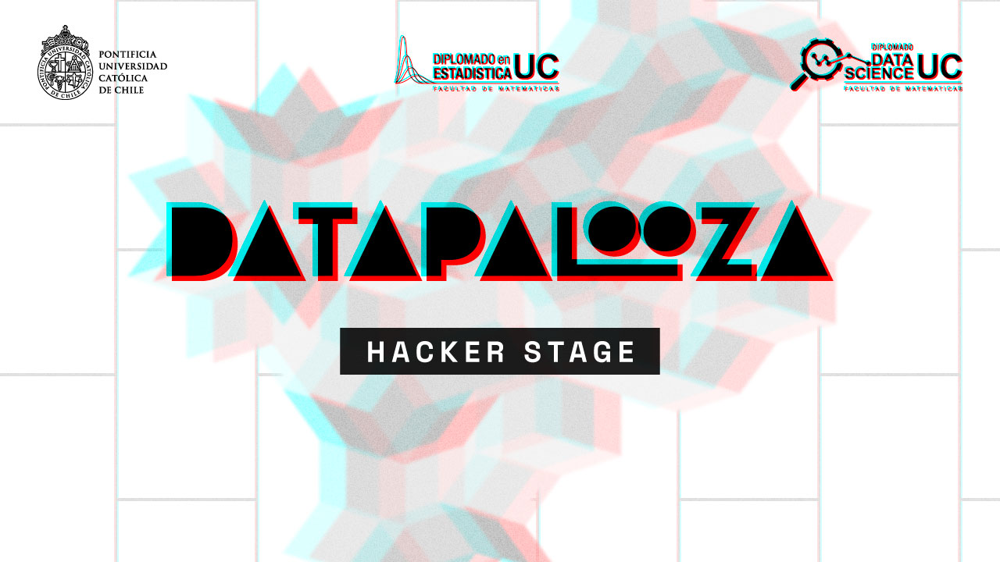

# Datapalooza 2024: Web scraping con Python

Este es el repositorio del taller sobre "Web scraping con Python" para el evento **Datapalooza 2024**, organizado por [Data UC](https://datascience.uc.cl/). En este taller aprenderemos a implementar la técnica de extracción de datos conocida como web scraping sobre sitios web estáticos usando la librería Beautiful Soup.



## Preparación 

Para realizar las actividades planificadas necesitarás las librerías `request`, `beautifulsoup4`, `lxml` y `pandas`. Se pueden instalar desde [PyPI](https://pypi.org/) con `pip`. 

```
pip install beautifulsoup4
pip install requests
pip install pandas
pip install lxml
```

Si prefieres trabajar en Google Colab, no olvides agregar un signo de exclamación al inicio de cada línea para su instalación, es decir:

```
!pip install beautifulsoup4
!pip install requests
!pip install pandas
!pip install lxml
```
(Esto le indica a Google Colab que ese no es código de Python, sino código que tiene que ejecutarse en la Terminal.)

Si trabajas en Visual Studio Code o en otro IDE, será necesario que crees un entorno virtual. Durante la sesión mostraremos cómo hacerlo, pero si quieres adelantarte puedes revisar [las indicaciones en este documento](https://github.com/rivaquiroga/datapalooza2024-webscraping/blob/main/crear-entorno-virtual.md).

## Atajos de teclado útiles

Los siguientes atajos de teclado serán útiles al explorar las páginas web que _escrapearemos_.

| Acción | Windows / Linux | Mac |
|---|---|---|
| Ver el código fuente de una página | ctrl +  u | command + u|
| Abrir el panel de desarrollo | F12<br/>ctrl + shift + i | F12<br/>option + command +i |
| Abrir el panel de desarrollo con la opción de selección activada | ctrl + shift + c | option + command + c |

## Actividades

Acá quedarán los enlaces al código y materiales que utilizaremos en la sesión. 
